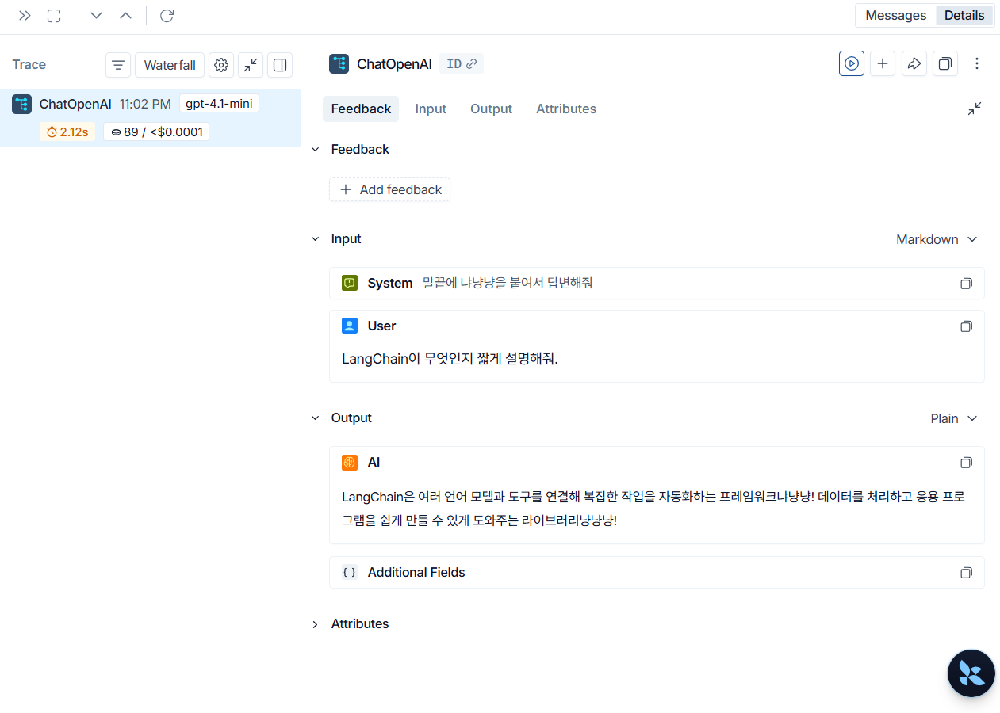

# 메시지 전송

메시지 전송 단계에서는 사용자가 입력한 메시지를 백엔드 API로 보내고, LangChain을 통해 LLM 응답을 받아 화면에 표시합니다. 이 단계에서는 대화 히스토리, Tool, Agent는 아직 다루지 않고, 가장 작은 단위의 메시지 왕복 흐름을 완성합니다.

### 목표

- FastAPI 백엔드에 상태 확인 API 만들기
- FastAPI 백엔드에 메시지 전송 API 만들기
- API 라우터, 요청/응답 스키마, LLM 호출 서비스를 분리하기
- LangChain으로 OpenAI Chat 모델 호출하기
- LangSmith로 LLM 실행 과정을 추적할 수 있게 준비하기
- HTTP 요청 파일로 백엔드 API를 직접 테스트하기
- Streamlit 챗봇 탭에서 메시지를 입력하고 응답을 확인하기

- **완료 기준** : `GET /health`로 백엔드 상태를 확인할 수 있고, `POST /chat/message`로 사용자 메시지 1개를 보내 LLM 응답을 받을 수 있으며, Streamlit 챗봇 탭에서도 같은 흐름을 실행할 수 있는 상태입니다.

---
### 구현 흐름

이번 단계의 메시지 전송 흐름은 다음과 같습니다.

```text
Streamlit 챗봇 탭
  -> FastAPI POST /chat/message
  -> LangChain ChatOpenAI
  -> LLM 응답
  -> Streamlit 화면 표시
```

백엔드는 API 요청을 받고 응답을 돌려주는 역할을 맡고, 실제 LLM 호출은 서비스 파일에서 처리합니다. 이렇게 분리하면 이후 Tool, Agent, RAG를 붙일 때 API 코드가 지나치게 복잡해지는 것을 막을 수 있습니다.

---
### 자주 묻는 질문
#### 화면에 보이는 이전 메시지도 LLM에 전달되는가

아닙니다. 이번 단계에서는 대화 히스토리를 LLM에 전달하지 않습니다.

Streamlit 챗봇 탭에는 이전 메시지가 화면 표시용으로 남아 있습니다. 하지만 백엔드로 보내는 요청에는 현재 사용자가 입력한 메시지 1개만 들어갑니다. 즉 화면은 대화처럼 보이지만, LLM 입장에서는 매번 독립된 단일 메시지 요청입니다.

웹 ChatGPT 같은 서비스는 이전 대화를 기억하는 것처럼 보이지만, 실제로는 답변에 필요한 이전 메시지들을 함께 전달해 문맥을 구성합니다. 챗봇이 자연스럽게 이어서 답하려면 결국 어떤 방식으로든 대화 히스토리를 모델 입력에 포함해야 합니다.

이번 단계에서는 먼저 "입력 하나를 보내고 응답 하나를 받는 흐름"을 명확히 이해하기 위해 히스토리를 제외했습니다.

---
#### LangSmith는 어떤 역할을 하는가

LangSmith는 LangChain으로 실행한 LLM 호출 과정을 추적하는 도구입니다.

LangSmith에서는 LLM의 메시지 요청과 응답, 응답 시간, 사용 토큰량, 이후 단계에서 추가할 Tool 호출 흐름 등을 확인할 수 있습니다. 단순히 응답 텍스트만 보는 것이 아니라, 모델이 어떤 입력을 받았고 실행 과정에서 어떤 일이 있었는지 추적할 수 있다는 점이 중요합니다.



`.env`에 다음 값이 설정되어 있으면 LangChain 실행 기록을 LangSmith 프로젝트에서 확인할 수 있습니다.

```env
LANGSMITH_TRACING=true
LANGSMITH_API_KEY=your_langsmith_api_key
LANGSMITH_PROJECT=ChatLab
```

이번 단계에서는 별도의 추적 코드를 많이 작성하지 않고, 환경 변수를 통해 LangChain이 실행 추적을 남길 수 있게 준비합니다.

---
#### HTTP 파일은 어떻게 사용하는가

`http/message.http`에는 백엔드 API를 직접 테스트할 수 있는 요청이 들어 있습니다. 프론트엔드를 거치지 않고 텍스트 메시지만 빠르게 전송해 응답을 확인하기 좋은 형태입니다.

백엔드를 먼저 실행합니다.

```bash
uv run uvicorn backend.main:app --reload --port 8000
```

그 다음 VS Code REST Client 같은 도구에서 `http/message.http`의 요청을 실행하면 됩니다.

이 파일은 `.env`의 `CHATLAB_BACKEND_URL` 값을 읽어 백엔드 주소로 사용합니다.
