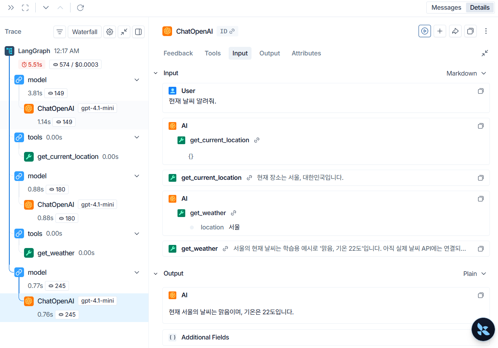

# Agent

Agent 단계에서는 LangChain의 `create_agent`를 사용해 LLM이 Tool을 한 번만 호출하는 구조에서 벗어나, 필요한 Tool을 순서대로 선택하고 실행 결과를 바탕으로 다음 행동을 이어갈 수 있는 구조로 전환합니다.

### 목표

- Agent가 필요한 상황 이해하기
- 단순 Tool calling과 Agent 실행 흐름의 차이 이해하기
- ReAct가 무엇이고 Agent 실행에서 어떤 역할을 하는지 이해하기
- LangChain `create_agent`로 Agent 만들기
- 기존 시간, 위치, 날씨 Tool을 Agent에 연결하기
- 장소가 없는 날씨 질문에서 위치 Tool과 날씨 Tool이 순차적으로 실행되는 흐름 확인하기
- LangSmith에서 Agent와 Tool 실행 과정을 추적하기

- **완료 기준** : 사용자가 "현재 날씨 알려줘"처럼 장소를 직접 입력하지 않아도 Agent가 `get_current_location`으로 장소를 확인하고, 그 장소를 `get_weather`에 전달해 최종 응답을 만들 수 있는 상태입니다. 또한 ReAct의 판단, 행동, 관찰 흐름을 설명할 수 있고, LangSmith에서 Agent가 어떤 Tool을 어떤 순서로 호출했는지 확인할 수 있어야 합니다.

---
### 왜 Agent가 필요한가

이전 단계에서는 LLM이 만든 Tool call을 애플리케이션 코드가 직접 실행했습니다.

흐름으로 보면 사용자 메시지가 들어온 뒤, Tool 목록이 연결된 LLM이 Tool call을 만들고, 애플리케이션이 Tool을 실행한 다음, Tool 결과를 다시 LLM에게 전달해 최종 응답을 만드는 방식입니다.

이 구조는 현재 시간 조회처럼 Tool 하나만 필요한 요청에는 충분합니다.

하지만 다음 질문은 조금 다릅니다.

"현재 날씨 알려줘." 같은 질문이 대표적인 예시입니다.

날씨를 조회하려면 장소가 필요합니다. 사용자가 장소를 말하지 않았기 때문에 먼저 현재 장소를 확인해야 하고, 그 결과를 다시 날씨 Tool의 입력으로 사용해야 합니다.

이 요청을 처리하려면 먼저 현재 장소를 확인하고, 확인한 장소로 현재 날씨를 조회한 뒤, 날씨 결과를 사용자에게 답해야 합니다.

이처럼 여러 Tool을 순차적으로 사용하고, 중간 결과를 보고 다음 행동을 결정해야 할 때 Agent가 필요합니다.

---
### `create_agent`로 전환하기

이번 단계에서는 `backend/services/llm_service.py`의 LLM 호출 흐름을 `create_agent`로 바꿉니다.

기존에는 서비스 코드가 Tool 호출 결과를 직접 읽고, 호출된 Tool을 찾아 실행하고, 그 결과를 다시 LLM에게 넘기는 과정을 모두 관리했습니다.

Agent로 전환한 뒤에는 모델과 Tool 목록을 `create_agent`에 넘기고, 사용자 메시지를 Agent에 전달합니다. 그러면 Agent가 모델 호출, Tool 실행, Tool 결과 반영, 다음 판단 과정을 이어서 실행합니다.

이 변경 덕분에 애플리케이션 코드는 "Tool을 어떻게 반복 실행할 것인가"보다 "어떤 Tool을 Agent에게 제공할 것인가"에 집중할 수 있습니다.

---
### ReAct란 무엇인가

ReAct는 Reasoning과 Acting을 함께 사용하는 Agent 실행 방식입니다.

Reasoning은 모델이 사용자의 요청을 보고 다음에 무엇을 해야 할지 판단하는 과정입니다. Acting은 그 판단에 따라 Tool을 호출하는 과정입니다. Tool 실행 결과가 돌아오면 Agent는 그 결과를 관찰하고, 추가 행동이 필요한지 다시 판단합니다.

즉 ReAct 흐름은 한 번의 답변 생성이 아니라 판단, 행동, 관찰, 다시 판단의 반복에 가깝습니다.

이번 예제에서 사용자가 "현재 날씨 알려줘."라고 말하면 Agent는 바로 날씨를 답할 수 없습니다. 먼저 장소가 없다는 점을 판단하고 `get_current_location`을 사용합니다. 그 결과로 장소를 확인한 뒤에는 다시 판단해서 `get_weather`를 호출합니다. 마지막으로 날씨 Tool 결과를 관찰하고 사용자에게 최종 답변을 만듭니다.

이 흐름이 Agent를 단순한 Tool 호출기와 다르게 만드는 핵심입니다. Agent는 Tool 하나를 실행하는 데서 멈추지 않고, Tool 결과를 다음 판단의 재료로 사용합니다.

---
### 이번 단계에서 사용하는 Tool

Agent에 연결하는 Tool은 이전 단계에서 만든 `backend/tools/chat_tools.py`의 Tool 목록을 그대로 사용합니다.

- `get_current_time` : 현재 서버 기준 시간을 반환합니다.
- `get_current_location` : 학습용 기본 위치인 `서울, 대한민국`을 반환합니다.
- `get_weather` : 입력받은 장소의 현재 날씨를 반환합니다.

날씨 Tool은 아직 실제 날씨 API와 연결되어 있지 않습니다. 이번 단계의 목적은 실제 기상 정보를 가져오는 것이 아니라, Agent가 여러 Tool을 이어서 사용할 수 있는지 확인하는 것입니다.

---
### Agent 실행 흐름

사용자가 장소 없이 현재 날씨를 물어보면 Agent는 다음처럼 실행할 수 있습니다.

흐름으로 보면 사용자 메시지가 Agent에 전달되고, LLM이 `get_current_location` 호출을 결정합니다. 위치 Tool이 실행된 뒤에는 그 결과를 보고 LLM이 다시 `get_weather` 호출을 결정합니다. 마지막으로 날씨 Tool 결과를 바탕으로 사용자에게 보여줄 최종 응답을 생성합니다.

이 흐름에서 중요한 점은 첫 번째 Tool 결과가 두 번째 Tool의 입력으로 사용된다는 것입니다.

단순 Tool calling 단계에서는 이 반복 흐름을 직접 코드로 작성해야 했습니다. Agent를 사용하면 LangChain이 Tool 호출과 관찰 결과 반영 과정을 관리합니다.

---
### LangSmith에서 확인하기

LangSmith를 사용하면 Agent가 실제로 어떤 순서로 실행되었는지 확인할 수 있습니다.

아래 예시는 사용자가 "현재 날씨 알려줘."라고 요청했을 때의 실행 결과입니다.

왼쪽 trace를 보면 `LangGraph` 실행 아래에 모델 호출과 Tool 실행이 번갈아 나타납니다.

- 첫 번째 모델 호출에서 `get_current_location` Tool call 생성
- `get_current_location` 실행 결과로 `서울, 대한민국` 확인
- 두 번째 모델 호출에서 `get_weather` Tool call 생성
- `get_weather` 입력값으로 `서울` 전달
- 마지막 모델 호출에서 사용자에게 보여줄 최종 답변 생성

LangSmith를 보면 Agent가 단순히 답변 문장만 만든 것이 아니라, 중간에 어떤 Tool을 호출했고 각 Tool의 입력과 출력이 무엇이었는지 추적할 수 있습니다.

---
### 직접 확인하기

백엔드를 먼저 실행합니다. 실행 명령은 이전 단계와 동일하게 `uvicorn`으로 `backend.main:app`을 띄우면 됩니다.

그 다음 Streamlit 앱이나 `http/tool_message.http` 요청으로 다음처럼 질문합니다.

"현재 날씨 알려줘."

응답에서는 다음을 확인합니다.

- 장소를 직접 입력하지 않아도 답변이 생성되는가
- 현재 위치 Tool이 먼저 실행되는가
- 위치 결과가 날씨 Tool 입력으로 사용되는가
- 최종 응답이 Tool 결과를 바탕으로 만들어지는가

LangSmith에서는 trace 상세 화면에서 `model`, `tools`, `get_current_location`, `get_weather` 실행 순서를 확인합니다.

---
### Agent와 Tool의 관계

Tool은 애플리케이션이 제공하는 기능입니다. Agent는 그 Tool을 언제, 어떤 순서로 사용할지 판단하고 실행 흐름을 이어가는 구조입니다.

즉 Tool만 있다고 Agent가 되는 것은 아닙니다. Tool은 사용할 수 있는 기능 목록이고, Agent는 그 기능들을 사용해 문제를 해결하는 실행자에 가깝습니다.

이번 단계에서는 이미 만든 Tool을 Agent에 연결해 "LLM이 한 번 Tool을 고르는 구조"에서 "필요한 만큼 Tool을 고르고 결과를 관찰하는 구조"로 확장합니다.

---
### 자주 묻는 질문
#### Agent를 쓰면 Tool이 자동으로 만들어지는가

아닙니다. Agent는 이미 만들어진 Tool을 사용할 수 있을 뿐입니다. Tool 함수, 이름, 설명, 입력 스키마는 개발자가 직접 정의해야 합니다.

---
#### 항상 Agent를 써야 하는가

항상 그렇지는 않습니다. 질문 하나에 Tool 하나만 실행하면 되는 단순한 기능은 직접 Tool call을 처리해도 됩니다.

하지만 여러 Tool을 순서대로 사용해야 하거나, Tool 결과를 보고 다음 행동을 다시 판단해야 한다면 Agent를 사용하는 편이 자연스럽습니다.

---
#### 현재 위치와 날씨는 실제 정보인가

아닙니다. 이번 단계의 `get_current_location`과 `get_weather`는 학습용 Tool입니다. 각 Tool의 자세한 동작은 [Tool 만들기](?tab=설명&doc=03_Tool만들기) 문서를 참고하면 됩니다.
